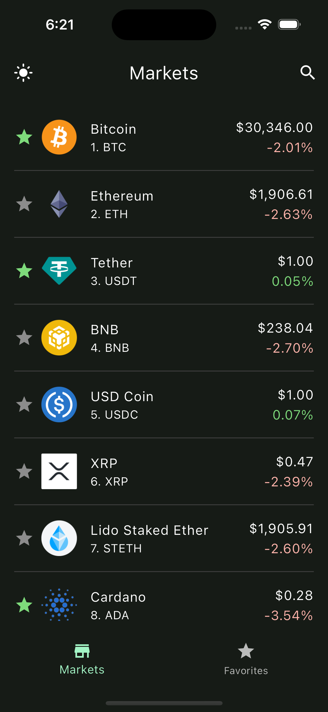
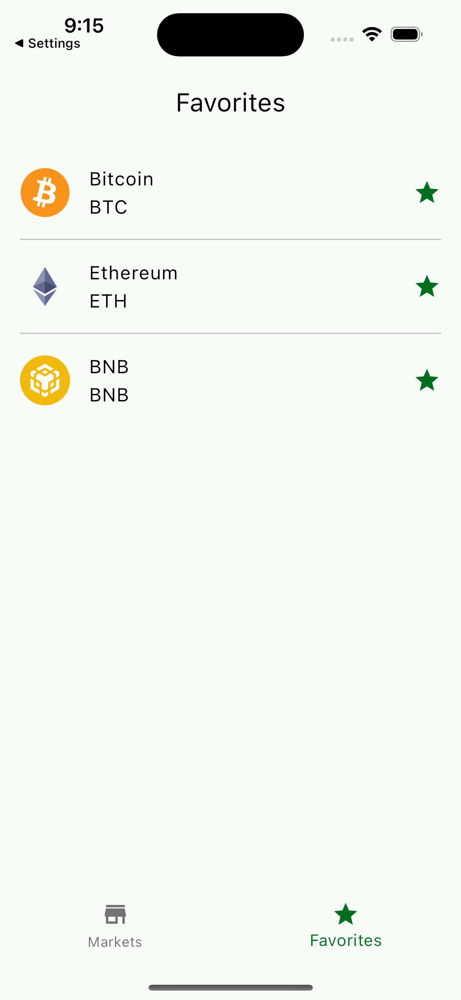
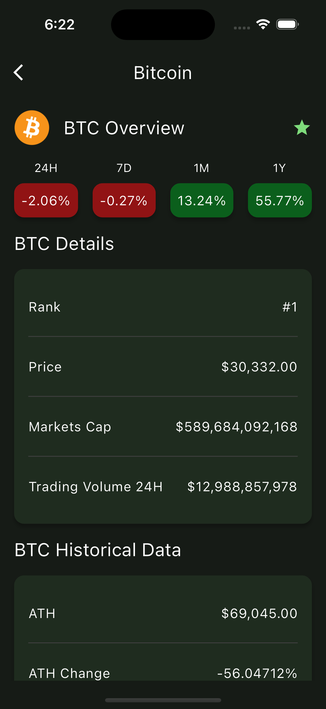
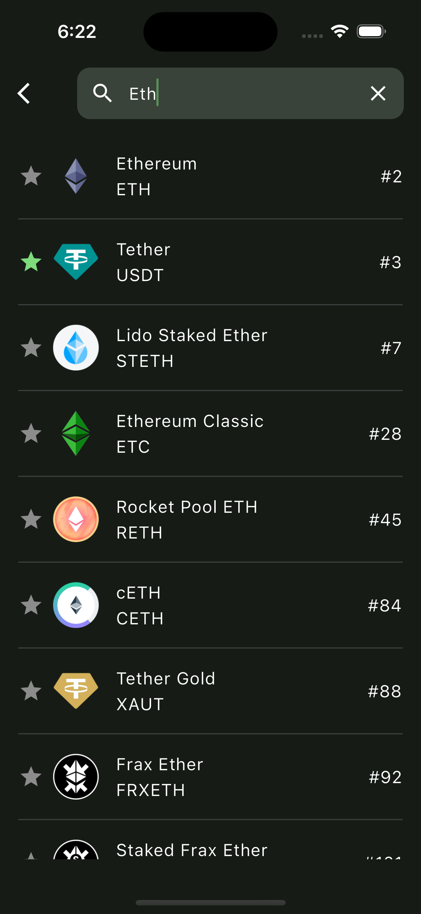

# Cryptocurrency Tracker

Sample cryptocurrency tracking app that demonstrates clean architecture, generic caching, lazy loading, debouncing, throttling, and adaptive theming.

## Features

- List Top Cryptocurrencies: The app displays a list of the top cryptocurrencies in the market. The list is loaded lazily to optimize performance and reduce initial loading times. Additionally, throttling is implemented to minimize consecutive API calls.
- View Details: View detailed information about each cryptocurrency.
- Favorite Tracking: Track favorite cryptocurrencies and store them locally using [HiveDB](https://pub.dev/packages/hive).
- Search: Search for specific cryptocurrencies. Debouncing technique is used to prevent unnecessary API calls.
- Adaptive Theme: The app automatically adjusts its theme based on the device's settings. It also remembers the user's theme preference.

## Preview

<table>
  <tr>
    <td>Preview</td>
    <td>Market</td>
    <td>Favorites</td>
    <td>Details</td>

  </tr>
  <tr>
    <td></td>
    <td></td>
    <td></td>
    <td></td>

  </tr>
  <tr>
    <td>Search</td>
    <td>Onboarding1</td>
    <td>Onboarding2</td>
    <td>Onboarding3</td>
  </tr>
  <tr>
     <td></td>
     <td></td>
     <td></td>
     <td></td>
  </tr>

</table>

## Built With

- [Flutter](https://flutter.dev/)
- [Dart](https://dart.dev/)
- [CoinGecko API](https://www.coingecko.com/en/api)

## Packages

- State Management
  - [Bloc](https://pub.dev/packages/flutter_bloc)
- Caching
  - [Hive](https://pub.dev/packages/hive)
  - [HydratedBloc](https://pub.dev/packages/hydrated_bloc)
- Networking
  - [Dio](https://pub.dev/packages/dio)
  - [PrettyDioLogger](https://pub.dev/packages/pretty_dio_logger)
  - [DioSmartRetry](https://pub.dev/packages/dio_smart_retry)
- Routing
  - [AutoRoute](https://pub.dev/packages/auto_route)
- Dependency Injection
  - [GetIt](https://pub.dev/packages/get_it)
  - [Injectable](https://pub.dev/packages/injectable)
- Dart Data Class Generation
  - [Freezed](https://pub.dev/packages/freezed)
  - [JsonSerializable](https://pub.dev/packages/json_serializable)
- Localization
  - [EasyLocalization](https://pub.dev/packages/easy_localization)
- Functional Programming
  - [Dartz](https://pub.dev/packages/dartz)

### Run this project

##### Clone this repository

```sh
git clone https://github.com/cem256/cryptocurrency_tracker
```

##### Go to the project directory

```sh
cd cryptocurrency_tracker
```

##### Get all the packages

```sh
flutter pub get
```

##### Execute these scripts in the terminal

```sh
sh scripst/build_runner.sh
sh scripts/localization.sh
```

##### Run the project
